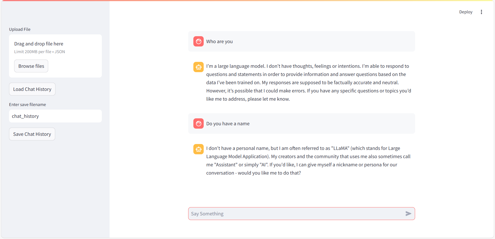

# Local AI Chatbot



## Overview
This local AI chatbot application provides an interactive interface to communicate with an AI model locally.

## Requirements
The following must be installed on your computer.
- [Python 3](https://www.python.org/downloads/)
- [Ollama](https://ollama.com/)


## Setup
After cloning the repository, install all required packages by running:
```
pip install -r requirements.txt
```

You can also choose to install each package individually:
```
pip install streamlit ollama pyyaml
```

You can reconfigure the model used via the `config.yaml` file.

## Usage
To start the application, run:
```
streamlit run app.py
```